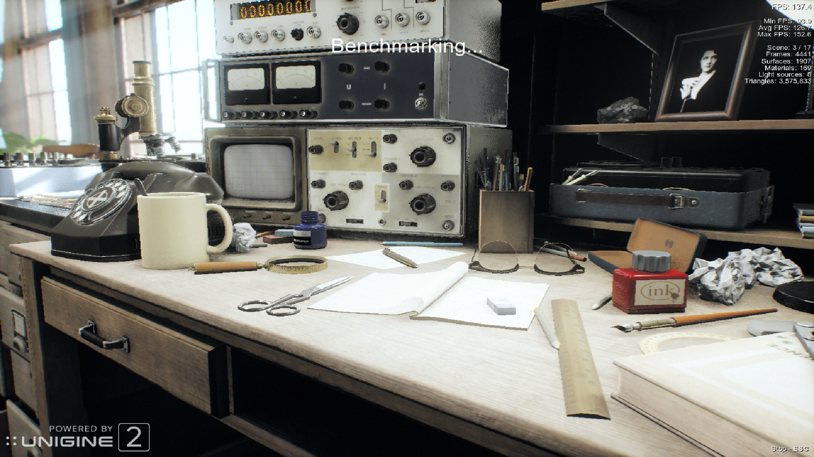
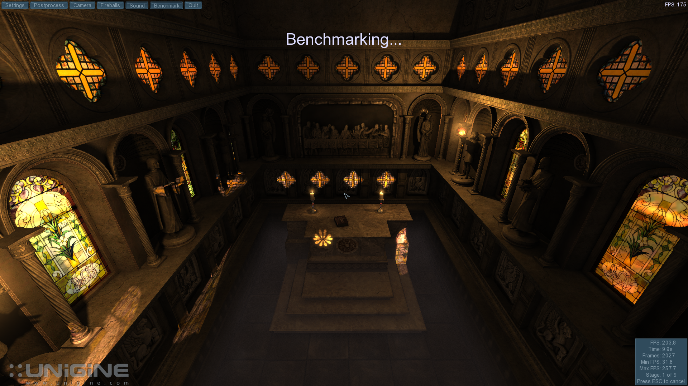

# Yttrium: Direct3D acceleration for Windows on KVM/QEMU

> **Alpha software:** a Windows virtual machine should not have to look like one.

Yttrium brings hardware-accelerated **Direct3D 9, 10, and 11, Vulkan, and
OpenGL** graphics to Windows guests using a paravirtualized VirtIO GPU. Its
Direct3D driver uses the Venus protocol to carry graphics work to the host's
Vulkan GPU without dedicating a physical GPU to the guest.

The goal is simple: a responsive Windows desktop, smooth 3D applications, and
modern visual effects inside an ordinary KVM/QEMU virtual machine.

## Components

Yttrium spans several repositories; this KMD repository is only one part of
the complete stack.

| Component | Repository | Purpose |
| --- | --- | --- |
| Windows KMD | This repository | WDDM device, memory, scheduling, and display integration |
| Mesa UMD | [virtio-win-mesa, `yttrium-experimental`](https://github.com/arehnman/virtio-win-mesa/tree/yttrium-experimental) | Direct3D, Vulkan, and OpenGL user-mode drivers |
| QEMU | [yttrium-qemu, `yttrium`](https://github.com/arehnman/yttrium-qemu/tree/yttrium) | VirtIO GPU device and nonblocking display integration |
| virglrenderer | [virglrenderer, `yttrium`](https://github.com/arehnman/virglrenderer/tree/yttrium) | Venus renderer and cross-context resource sharing |
| Host bundle | [yttrium-qemu-flatpak](https://github.com/arehnman/yttrium-qemu-flatpak) | Reproducible QEMU and virglrenderer Flatpak build |

## See Yttrium in action

These scenes are rendered inside a Windows guest through the Yttrium Direct3D
driver, not on the Linux host desktop.



_Complex materials, reflections, depth of field, particles, and millions of triangles in Unigine Superposition._



_Dynamic lighting, shadows, fire, fog, and stained-glass reflections in Unigine Sanctuary._

## What Yttrium offers

*   **Direct3D 9, 10, and 11:** run a broad range of Windows 3D applications and
    older games through the standard Windows graphics APIs they already use.
*   **Real host-GPU acceleration:** demanding rendering work is sent through
    Vulkan/Venus to the host GPU instead of being drawn entirely by the guest CPU.
*   **No dedicated GPU required:** the VirtIO model is designed to share graphics
    capability with a VM rather than reserve a physical card for passthrough.
*   **An easier host setup:** the Yttrium QEMU Flatpak packages QEMU and
    virglrenderer together, avoiding the work of building both projects yourself.
*   **32-bit and 64-bit application support:** one driver package covers both
    generations of Windows software.
*   **More than Direct3D:** the Yttrium stack also includes OpenGL through Zink
    and Vulkan through Venus.
*   **Open and built on Mesa:** the graphics stack is inspectable, hackable, and
    open to contributions.

## How it works

Yttrium acts as an interpreter between a Windows application and the host GPU.
Direct3D calls enter Mesa's Gallium graphics layer; shaders are translated through
NIR into SPIR-V; and Venus carries the resulting Vulkan work across the VM boundary.
VirtIO shared resources then connect the rendered image to the Windows display.

That path supports everyday presentation as well as advanced 3D work such as
programmable shaders, multiple render targets, depth and stencil buffers,
multisampling, compute workloads, texture compression, and stream output.

The Yttrium graphics driver requires a modified virglrenderer on the host to
provide cross-context resource sharing. The Flatpak build packages the matching
QEMU and virglrenderer revisions together. QEMU also carries a small patch that
prevents its display path from blocking the Windows guest when the display
window is hidden or minimized.

## Project status

Yttrium is active, experimental driver work. The alpha has passed the project's
Direct3D Wine test suites and runs complex applications and benchmarks, but it
still has bugs and may crash or hang a guest. **Do not use it for production
work or with data you cannot afford to lose.**

The current qualification target is a Windows 10 x64 guest on an Intel Arc A580
host. Other Vulkan-capable host GPUs and Windows configurations may work, but
have not received the same testing.

Contributions and merge requests are very welcome. This project has two simple
rules:

1.  It builds and runs.
2.  Avoid changes to Mesa core code when the work can live in Yttrium.


_The wider Yttrium stack running Vulkan workloads alongside the Windows desktop._

## Windows 10 Yttrium driver installation

Download the alpha driver archive from this repository's
[Releases](https://github.com/arehnman/kvm-guest-drivers-windows/releases)
page and extract it in the guest.

Install `VirtIOTestCert.cer` in **Trusted Root Certification Authorities**.
The certificate is included in the release archive and source tree. The alpha
driver is test-signed; it is not Microsoft-signed.

Disable Secure Boot in the VM's UEFI settings.

Enable Windows test-signing mode from an administrator command prompt, then
reboot:

```bat
bcdedit /set testsigning on
```

In Device Manager, select the display adapter and choose **Update driver >
Browse my computer for drivers**, then point Windows to the extracted Yttrium
driver directory.

If an older Yttrium release is installed, uninstall it first and select the
option to delete the old driver package. Reboot after installation.

## Vulkan runtime installer

Download and run the [Vulkan Runtime Installer](https://vulkan.lunarg.com/sdk/home).
It provides the `vulkan-1.dll` loader and the `vulkaninfo` utility.

## Linux host setup

The recommended alpha configuration uses the Yttrium Flatpak so that QEMU and
virglrenderer remain at compatible revisions. Download
`org.qemu.yttrium.flatpak` from the
[Yttrium QEMU Flatpak releases](https://github.com/arehnman/yttrium-qemu-flatpak/releases),
then install it for the current user:

```sh
flatpak install --user ./org.qemu.yttrium.flatpak
```

Verify the installation:

```sh
flatpak run org.qemu.yttrium --version
```

The optional `org.qemu.yttrium.Debug.flatpak` release asset contains host debug
symbols. Developers who want to build the host stack can use the
[Flatpak source repository](https://github.com/arehnman/yttrium-qemu-flatpak).

Recent official QEMU builds can also run Yttrium, but they must use a locally
built copy of the
[Yttrium virglrenderer](https://github.com/arehnman/virglrenderer/tree/yttrium).
Unlike the Yttrium Flatpak, official QEMU builds do not include the display
progress patch. An invisible, hidden, or minimized display window may therefore
stall the guest; keep the display visible while running graphics workloads.

## QEMU setup

Vulkan/Venus requires host-shared memory for the guest VM. This minimal example
uses the Yttrium Flatpak and exposes 4 GiB of host-visible graphics memory:

```sh
IMG=win10-box.qcow2
ISO=Win10_22H2_English_x64.iso

flatpak run org.qemu.yttrium                                     \
    -enable-kvm                                                  \
    -smp 4                                                       \
    -m 8G                                                        \
    -cpu host                                                    \
    -object memory-backend-memfd,id=mem1,size=8G,share=on        \
    -machine q35,memory-backend=mem1                             \
    -device virtio-vga-gl,hostmem=4G,blob=on,venus=on            \
    -vga none                                                    \
    -display gtk,gl=on                                           \
    -device usb-tablet                                           \
    -netdev user,id=net0,hostfwd=tcp::2222-:22                   \
    -device e1000e,netdev=net0                                   \
    -drive file="$IMG",if=ide                                   \
    -cdrom "$ISO"                                                \
    -d guest_errors
```

Adjust storage, networking, audio, firmware, and memory settings for your VM.
The essential Yttrium options are the shared memory backend and
`virtio-vga-gl` with `blob`, `venus`, and a nonzero `hostmem` aperture.

## Testing

FurMark 2.9.0 is a useful Vulkan/OpenGL smoke test. Version 2.10.2 currently
contains a Vulkan feature-negotiation crash on this configuration, so it is not
the alpha reference version.

```bat
cd C:\path\to\FurMark_2.9.0.0_win64\FurMark_win64

furmark --vkinfo

furmark --glinfo

furmark --demo furmark-vk

furmark --demo furmark-gl
```

`--vkinfo` should list the host GPU as a `Virtio-GPU Venus (...)` Vulkan
device. The number of listed devices depends on the host configuration.
`--glinfo` should report `Mesa` as `GL_VENDOR` and a `zink Vulkan ...
(Virtio-GPU Venus (...))` renderer using the intended host GPU. These commands
are useful for separating Vulkan device-discovery problems from OpenGL/Zink
adapter-selection problems before running the graphical demos.

A modified `vkcube` is also available in the
[Vulkan-Tools fork](https://github.com/arehnman/Vulkan-Tools).

## About this repository

This is a development fork of
[virtio-win/kvm-guest-drivers-windows](https://github.com/virtio-win/kvm-guest-drivers-windows).
The Yttrium driver is not part of the official Fedora or Red Hat virtio-win
packages and is not supported by those projects. Use the
[Fedora virtio-win documentation](https://docs.fedoraproject.org/en-US/quick-docs/creating-windows-virtual-machines-using-virtio-drivers/index.html)
for stable, non-Yttrium guest drivers.

To build this fork from source, follow the upstream
[Windows 11 24H2 EWDK build instructions](https://virtio-win.github.io/Development/Building-the-drivers-using-Windows-11-24H2-EWDK).
Locally built drivers are unsigned or test-signed and Windows will not load them
under its normal production signing policy.

## Licensing

This fork retains the upstream copyright and BSD-3-Clause notices. Yttrium
changes to `viogpu3d` are additionally covered by MPL-2.0 where marked in the
source files. Individual file headers are authoritative.

## Contributing

Bug reports and merge requests are welcome. Please include the guest Windows
version, host GPU and Vulkan driver, QEMU and virglrenderer revisions, and the
smallest reproducible workload. Never test a suspected hang with valuable guest
data.
